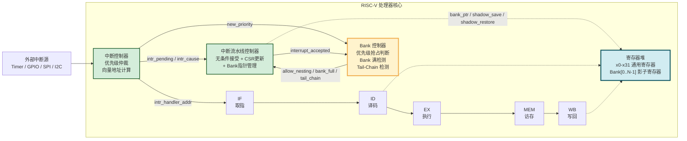
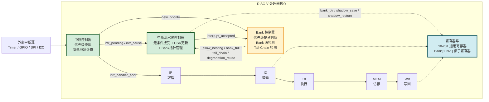
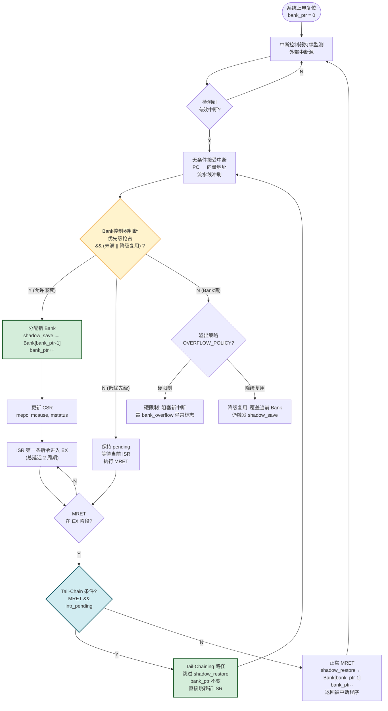
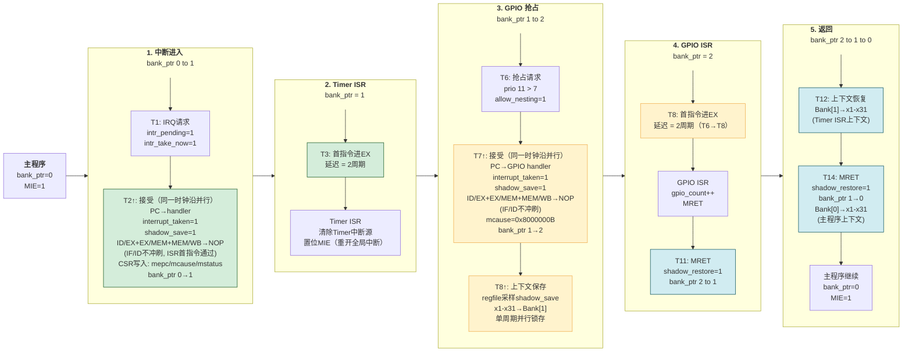
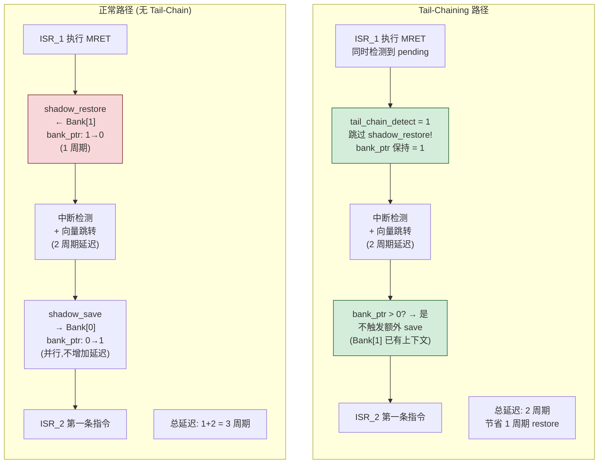
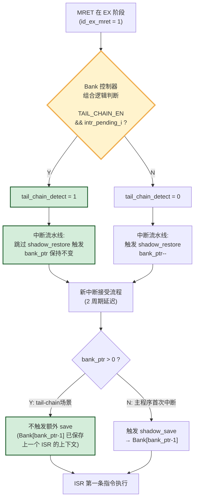
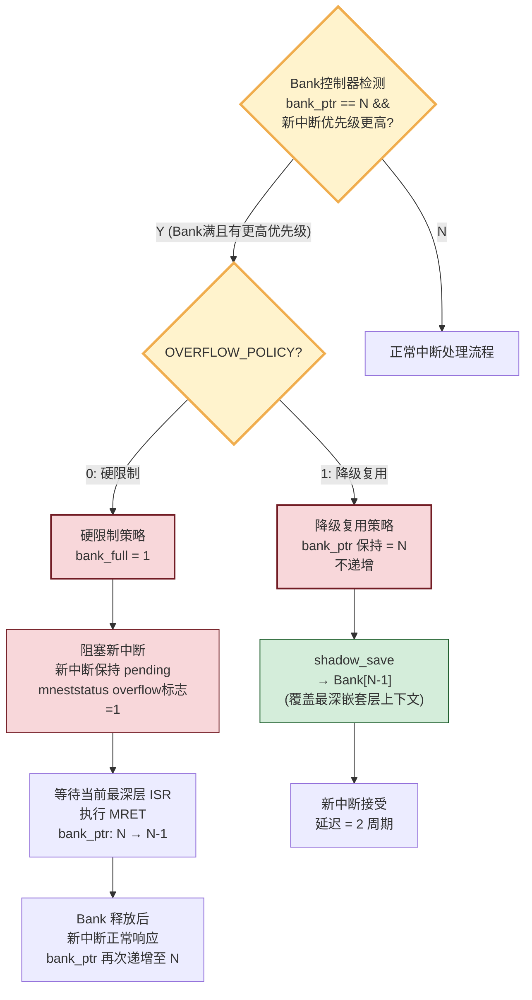
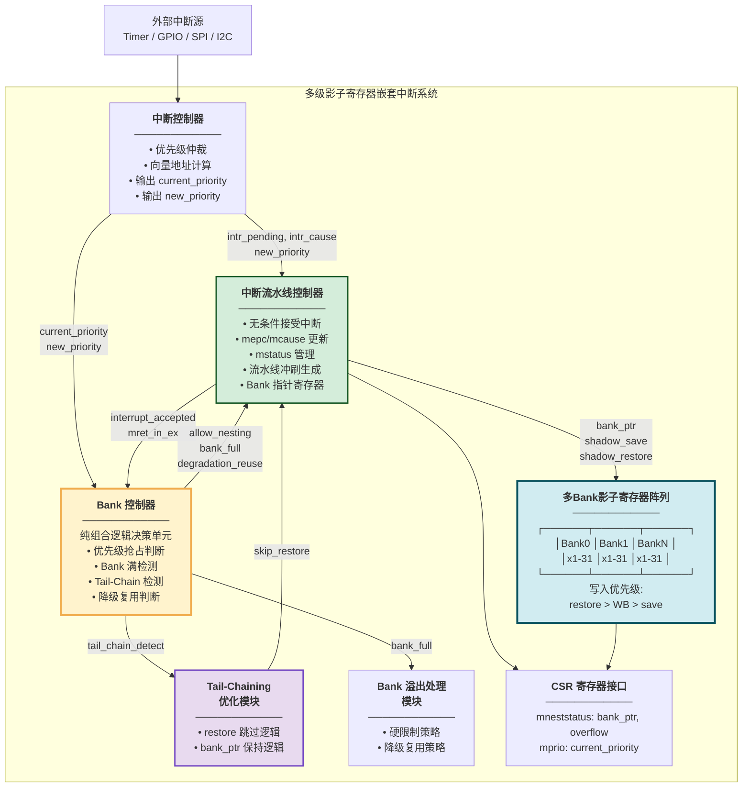

# 专利 Mermaid 图代码

> 使用方法：复制代码块到 [Mermaid Live Editor](https://mermaid.live) 即可实时预览并导出 SVG/PNG。

---

## 图 0：无条件中断接受机制 — 与基础方案的条件判断对比

> **图 0 说明**：上图展示基础方案（专利一）的"有条件"中断接受机制——需满足 EX 无分支/跳转且 MEM 无 load 才接受，延迟可变（2~4+N 周期）；下图展示在先设计（FX-RV32）中已实现的"无条件"中断接受机制——通过组合逻辑 `intr_take_now` 立即重定向 PC，无论流水线状态如何均在同周期内接受中断，延迟恒定为 2 个时钟周期。本发明（专利二）沿用该无条件接受机制，并在此基础上引入多 Bank 影子寄存器以支持中断嵌套。

---

## 图 1：多级影子寄存器在 RISC-V 核心中的整体架构

---

## 图 2：本发明方法总流程图

---

## 图 3：两级中断嵌套流程结构图

> **图 3 说明**：本图以五个阶段（P1-P5）从左至右展示两级中断嵌套的完整流程。P1（中断进入）：T1 组合逻辑产生 intr_pending 与 intr_take_now，next_pc 被驱动为 handler；T2↑ 时钟沿 PC 跳转至 handler，同时并行置位 interrupt_taken、shadow_save、流水线冲刷（ID/EX+EX/MEM+MEM/WB→NOP，IF/ID 不冲刷）及 CSR 更新（mepc/mcause/mstatus）等全部寄存器，bank_ptr 由 0 升至 1。P2（Timer ISR）：T3 首指令进入 EX 阶段，中断延迟为 2 个时钟周期（T1→T3）；ISR 执行期间，软件清除 Timer 中断源并通过 CSR 指令序列置位 MIE 以重开全局中断使能，为 GPIO 嵌套做准备。P3（GPIO 抢占）：T6 GPIO 中断到达（优先级 11>7），intr_pending 与 intr_take_now 再次置 1；T7↑ 时钟沿 PC 跳转至 GPIO handler，同时并行置位 interrupt_taken、shadow_save、流水线冲刷及 mcause 等全部寄存器，bank_ptr 由 1 升至 2；T8↑ 由 regfile 采样 shadow_save，将 x1-x31 并行锁存至 Bank[1]。P4（GPIO ISR）：T8 首指令进入 EX 阶段，嵌套延迟同为 2 个时钟周期（T6→T8）；G7 执行 MRET 触发 shadow_restore，bank_ptr 由 2 降为 1。P5（返回）：T12 从 Bank[1] 恢复 Timer ISR 上下文，T14 执行 MRET 从 Bank[0] 恢复主程序上下文，bank_ptr 归零。图中绿色为中断接受节点，黄色为嵌套抢占及上下文保存，蓝色为 MRET 及上下文恢复。

---

## 图 4：Tail-Chaining 优化 vs 正常路径对比

---

## 图 5：Tail-Chaining 硬件判断逻辑

---

## 图 6：Bank 溢出处理决策流程

> **图 6 说明**：Bank 溢出处理的硬件决策流程。当 bank_ptr 达到上限 N 且有更高优先级中断到达时，根据 `OVERFLOW_POLICY` 参数选择策略。左支（硬限制）：阻塞新中断并置溢出标志，等待当前 ISR 的 MRET 释放 Bank 后正常响应。右支（降级复用）：bank_ptr 不递增，shadow_save 覆盖 Bank[N-1]（最深嵌套层上下文），新中断以恒定 2 周期延迟立即响应。

---

## 图 7：系统架构模块图

---

## 使用方法

1. 打开 [https://mermaid.live](https://mermaid.live)
2. 复制上面任意一段代码到左侧编辑器
3. 右侧实时显示效果
4. 点击右上角 **Export** → 选择 **SVG** 或 **PNG** 导出
5. 插入到 Word 专利文档对应位置

- **图 2**（流程图）最复杂，导出时建议选 SVG（矢量无损）
- **图 3**（时序图）用 Mermaid 的 sequenceDiagram 画出来会自适应调整，效果不如 Wavedrom 精确。如需更精确的时序波形，建议用 [Wavedrom](https://wavedrom.com/editor.html)
- **图 7**（系统架构模块图）建议重点美化——专利里系统架构图往往占一整页
