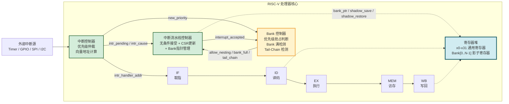
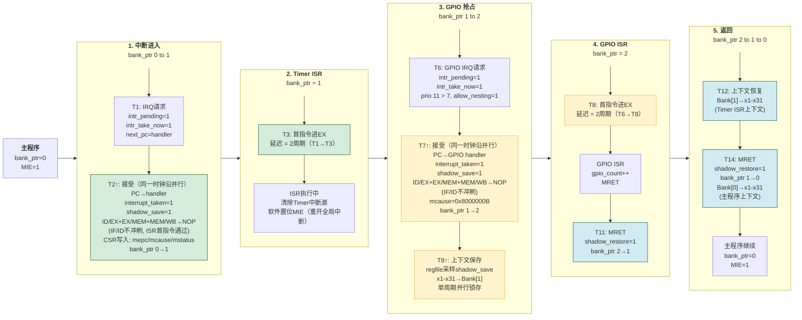

# 一种支持优先级中断嵌套的多级影子寄存器上下文保存与恢复装置及方法

---

## 专利基本信息

| 项目 | 内容 |
|------|------|
| **专利题目** | 一种支持优先级中断嵌套的多级影子寄存器上下文保存与恢复装置及方法 |
| **作者** | 易逢鑫 |
| **联系方式** | 15577607310 |
| **所属技术领域** | 处理器微架构设计、嵌入式实时系统、RISC-V 中断控制器 |

---

## 本发明中涉及的缩略词：

RISC-V：一种开放指令集架构（ISA），基于精简指令集计算机（RISC）原理设计。
RV32I：RISC-V 基础整数指令集，包含 32 位寻址空间和 40 条基本整数指令。
CSR：控制与状态寄存器（Control and Status Register），RISC-V 特权架构中用于配置和监控处理器状态的寄存器组。
ISR：中断服务程序（Interrupt Service Routine），处理器响应中断请求后执行的程序。
MEI：机器外部中断（Machine External Interrupt），RISC-V 特权架构中中断 ID 为 11 的中断源。
MTI：机器定时器中断（Machine Timer Interrupt），RISC-V 特权架构中中断 ID 为 7 的中断源。
MSI：机器软件中断（Machine Software Interrupt），RISC-V 特权架构中中断 ID 为 3 的中断源。
MRET：机器模式异常返回指令（Machine Return），RISC-V 特权架构中用于从中断或异常处理程序返回的指令。
mtvec：机器中断向量基址寄存器（Machine Trap Vector Base Address Register）。
mepc：机器异常程序计数器（Machine Exception Program Counter）。
mcause：机器异常原因寄存器（Machine Cause Register）。
mstatus：机器状态寄存器（Machine Status Register）。

## 本发明中涉及的术语定义：

影子寄存器：指处理器寄存器堆之外的额外物理寄存器组，用于在中断响应时自动保存通用寄存器的内容。影子寄存器采用全并行锁存方式，可在单个时钟周期内完成全部寄存器的快照捕获或恢复，无需软件逐条执行存储器压栈指令。

Bank：指影子寄存器中的一组完整的寄存器副本。每个 Bank 可独立保存一份完整的处理器上下文（通用寄存器 x1-x31），不同 Bank 之间相互独立、互不覆盖。

Bank 指针：指处理器内部维护的一个硬件计数器，用于指示当前活跃的 Bank 编号。Bank 指针的值等于当前中断嵌套的深度（0 表示主程序、1 表示第一级中断、N 表示第 N 级嵌套）。

优先级抢占：指当一个中断的优先级高于当前正在服务的中断时，硬件自动将当前中断的上下文保存到当前 Bank，并将 Bank 指针递增，然后跳转到新中断的处理程序。

尾链（Tail-Chaining）：指在 MRET 指令执行时，如果同时存在一个待处理的中断，硬件跳过当前中断上下文的恢复步骤，同时保持 Bank 指针不变，使新中断直接复用当前 Bank。

无条件中断接受：指中断流水线控制器在检测到中断请求后，不再等待执行阶段的分支/跳转指令完成、也不再等待访存阶段的加载指令完成，而是直接接受中断。该机制将中断延迟固定为 2 个时钟周期，不受中断到达时流水线内具体指令类型的影响。

中断延迟：指从中断请求被处理器核心接受（interrupt_taken 信号有效）开始，到中断服务程序的第一条指令进入执行阶段所需的时间。本发明中，该延迟固定为 2 个时钟周期。

---

## 一、发明背景

在嵌入式实时系统中，处理器需要对外部事件做出快速且确定性的响应。中断延迟是衡量实时性能的核心指标。在汽车电子、工业控制、无人机飞控等场景中，多个外部设备（传感器、执行器、通信接口）以不同频率和优先级异步产生中断请求——例如电动助力转向（EPS）系统中，扭矩过载保护中断需抢占角度采样中断；伺服电机控制中，电流环（50μs周期）中断需抢占速度环（200μs周期）中断。这对处理器的中断系统提出了两项核心要求：（1）支持基于优先级的抢占式中断嵌套，确保高优先级事件不被低优先级 ISR 阻塞；（2）中断延迟低且恒定，确保响应时间的确定性。

发明人先前设计了一种基于五级流水线的低延迟 RISC-V 处理器微架构，采用单组影子寄存器实现硬件上下文保存，中断接受条件为"EX 阶段无分支/跳转 且 MEM 阶段无 load"，延迟可静态枚举但不固定。然而，该方案存在以下局限：（1）仅一组影子寄存器，无法支持优先级中断嵌套——高优先级中断抢占低优先级 ISR 时，新中断的上下文保存会覆盖前者的影子寄存器内容；（2）中断延迟取决于流水线状态，无法保证恒定 2 周期；（3）缺乏尾链优化，连续中断场景存在"先恢复再保存"的冗余操作。

为克服上述局限，本发明将先前的有条件中断接受改进为无条件中断接受（实现恒定 2 周期中断延迟），同时将单组影子寄存器扩展为多组，提出了一种支持优先级中断嵌套的多级影子寄存器上下文保存与恢复装置及方法。核心思想是将寄存器堆中的单组影子寄存器扩展为多组（N 组）影子寄存器（Bank），由硬件 Bank 控制器自动管理 Bank 的分配与释放——使每级中断嵌套均拥有独立的上下文存储空间，从根本上解决了单组方案中高优先级中断覆盖低优先级 ISR 上下文的问题。同时，通过尾链（Tail-Chaining）优化在 MRET 时刻消除连续中断场景下的冗余上下文恢复操作。整个 Bank 管理机制（分配、释放、抢占判断、尾链、溢出处理）由硬件自动完成，对软件完全透明，无需任何 ISA 扩展。中断延迟在任意嵌套深度下均保持恒定的 2 个时钟周期。

---


## 二、与本发明相关的现有技术

### 2.1 基础方案：单组影子寄存器方案（有条件中断接受）

发明人在先前设计的基础方案中提出了一种基于五级流水线的低延迟 RISC-V 处理器。该处理器采用单组 31×32 位的影子寄存器，在中断响应时将 x1-x31 并行锁存到影子寄存器中。中断接受条件为"EX 阶段无分支/跳转 且 MEM 阶段无 load"，满足条件时中断延迟最小为 2 个时钟周期，不满足时等待至条件满足，典型延迟为 2、3、3+N 或 4+N 周期。该方案实现了中断延迟的确定性（可静态枚举），但延迟并非常数。

**不足**：（1）仅有一组影子寄存器，无法支持中断嵌套——高优先级中断抢占低优先级 ISR 时，新中断的上下文保存会覆盖前者的影子寄存器内容；（2）中断延迟取决于流水线状态，无法保证恒定 2 周期；（3）缺乏尾链优化。

### 2.2 CLIC 规范方案

RISC-V 快速中断任务组（Fast Interrupts Task Group）提出的 CLIC（Core-Local Interrupt Controller）规范[6]定义了一套完整的中断加速体系，包含多个模块化子扩展：

- **Smclicsh / Smtp**（硬件栈推入/弹出）：在中断响应时，硬件状态机自动将选定的寄存器（通常为 caller-save 寄存器 x5-x7、x10-x17、x28-x31 中的 2-10 个，可配置）串行推入内部硬件堆栈（xhv）或专用中断栈空间。推入操作通过内存总线逐寄存器执行，每寄存器消耗 1 个时钟周期。
- **Smnip / Ssnip**（水平嵌套抢占）：通过中断级别（interrupt level, 共 256 级）和中断阈值寄存器（mintthresh）实现可配置的优先级抢占——仅当中断级别高于当前阈值时才触发嵌套。
- **Smitv**（中断向量表）：提供硬件向量地址生成。
- **Smcsps**（条件栈指针交换）：在进入中断时自动将栈指针（sp）与专用陷阱栈指针（mscratchcsw）交换，实现安全的栈隔离。
- **mnxti CSR**（下一中断跳转）：软件通过读取 mnxti 寄存器原子性地完成"清除 pending + 自动重开 MIE + 获取下一向量地址"三个操作，配合软件实现中断尾链和嵌套。

CLIC 方案的典型中断响应流程：硬件检测到中断请求 → 硬件状态机将选定寄存器串行推入硬件堆栈（每寄存器 1 周期）→ 硬件更新 mintstatus/mcause → PC 跳转至向量地址 → ISR 执行。嵌套通过中断级别比较实现——高优先级中断可抢占低优先级 ISR，被抢占者的上下文已在进入时保存于硬件堆栈中。

**不足**：（1）上下文保存为串行操作，延迟与保存寄存器数量成正比——保存全部 10 个 caller-save 寄存器需 10 个时钟周期，仅保存 2 个也需 2 周期，延迟不具备常数特性；（2）硬件堆栈（xhv）需要专用存储资源（通常为片上 SRAM），面积开销随堆栈深度线性增长；（3）推入/弹出操作经过内存总线，在多主机系统中延迟受总线仲裁影响，不具备严格确定性；（4）mnxti 尾链依赖软件显式读取 CSR，非硬件自动触发，存在软件遗漏风险；（5）CLIC 引入多个新 CSR（mnxti、mintstatus、mintthresh、mclicbase 等），需要 ISA 扩展，破坏与已有 RISC-V 软件生态的二进制兼容性。

### 2.3 Sophon 自定义指令方案

Sophon 处理器[3]是一款面向嵌入式实时系统的单周期微架构 RISC-V 核心，其设计目标为提供时间可重复（time-repeatable）且低延迟的确定性响应。与传统流水线处理器不同，Sophon 核心内部无流水线——指令的取指、译码和执行在一个时钟周期内完成；无分支预测器和缓存，以彻底消除执行时间偏差。所有指令（除加载/存储外）均为单周期延迟，加载/存储指令访问 L1 数据存储器为 2 周期。

Sophon 通过 EEI（Enhanced ISA Extension Interface，增强 ISA 扩展接口）提供自定义指令扩展能力。EEI 接口支持两种指令类型：常规指令（最多 2 源操作数 + 1 目标操作数，采用 custom0 操作码）和增强指令（最多 32 源/目标操作数并行传输，采用 custom1 操作码）。基于 EEI 接口，Sophon 实现了两种自定义指令以降低控制延迟：

- **fGPIO 指令**：将 GPIO 引脚直接连接到核心的寄存器文件，通过自定义指令在一个周期内完成 GPIO 的读/写/位操作，消除了片上总线延迟和加载/存储延迟。GPIO 最大翻转频率可达核心频率的 1/2。
- **snapreg 指令**：用于加速上下文的保存与恢复。SNAPREG 是一个外部自定义执行单元，包含 32 个 32 位寄存器（与寄存器文件规格相同）。`snapreg.save` 指令在一个周期内将寄存器文件的全部 32 个寄存器并行复制到 SNAPREG 中；`snapreg.recover` 指令则在一个周期内从 SNAPREG 并行恢复到寄存器文件中。该操作为纯组合逻辑的并行锁存，不经过内存总线。

Sophon 的中断方案基于 RISC-V CLIC 扩展 v0.9 草案。每个外部中断源由 CLIC 控制器中的 4 个内存映射寄存器（ip/ie/attr/ctl）进行管理，支持中断级别和优先级配置。中断可配置为硬件向量模式或非硬件向量模式：

- **硬件向量模式**：核心从向量表中加载处理程序地址（需 2 周期，因向量表存储于 L1 数据 RAM 中），再加 1 周期将控制流转移至处理程序，中断延迟为 3 个时钟周期。
- **非硬件向量模式 + snapreg**：核心跳转至公共中断入口，软件执行 `snapreg.save` 保存上下文（1 周期），然后识别中断 ID 并跳转至对应处理程序，中断延迟为 7 个时钟周期。
- **非硬件向量模式（无 snapreg）**：软件使用存储指令逐个保存 16 个 caller-save 寄存器，中断延迟为 39 个时钟周期。

**不足**：（1）SNAPREG 仅实现了一组（32×32 位），一旦被 `snapreg.save` 占用，在 `snapreg.recover` 释放之前不可再次使用——论文明确指出"snapreg 指令不支持在中断嵌套场景中使用"。虽然论文提到可通过实现多个 SNAPREG 来解决此问题，但论文未给出多 SNAPREG 的 Bank 管理机制。（2）snapreg 指令需软件在 ISR 中显式调用——编译器需识别 `__attribute__((interrupt))` 并在 ISR 序言中插入 `snapreg.save`，这要求专用工具链支持且 ISR 编写者需明确知晓 snapreg 的存在。（3）EEI 接口引入 custom0/custom1 操作码，属于非标准 RISC-V ISA 扩展，破坏二进制兼容性——未经适配的标准 RISC-V 工具链无法汇编/反汇编包含 EEI 指令的代码。（4）中断延迟在硬件向量模式下为 3 周期，非硬件向量模式（snapreg）为 7 周期，均无法达到 2 周期的常数延迟。硬件向量模式的额外 1 周期来源于向量表位于 L1 数据 RAM 引起的加载延迟（2 周期），这是单周期微架构的固有开销。（5）Sophon 的单周期微架构虽然保证了时间可重复性，但所有指令串行执行（单发射、无流水线），导致非中断代码的执行吞吐率低于流水线处理器——对于需要同时处理计算密集型任务和快速中断响应的场景，存在吞吐率与延迟之间的折衷。

### 2.4 现有技术存在的问题

综合分析上述现有技术方案，当前领域内仍存在以下尚未被有效解决的技术问题：

**（1）上下文保存延迟与嵌套深度强耦合，不具备扩展性。** CLIC 的硬件栈推入为串行操作，每增加一个需保存的寄存器便增加一个时钟周期，全部 caller-save 寄存器（典型 10 个）需 10 个时钟周期。当嵌套深度增加时，每级嵌套均需重复此串行操作，总延迟与嵌套深度线性相关。对于需要 3 级以上嵌套的汽车电子/工业控制场景，上下文保存延迟可能累积至不可接受的水平。

**（2）中断延迟不具备严格的常数特性。** CLIC 方案中，中断延迟 = 硬件栈推入延迟（1-10 周期，取决于配置寄存器的数量）+ 向量跳转延迟（2 周期）——虽然可静态分析，但并非固定常数。当配置为保存全部 caller-save 寄存器时延迟高达 12 周期，配置为仅保存少量寄存器时可缩短，但需承担寄存器被意外覆盖的风险。基础方案的延迟取决于流水线状态（EX 指令类型、MEM load 状态），延迟可变范围为 2-4+N 周期。Sophon 方案的 snapreg 指令为单周期，但需软件显式调度。三种方案均无法实现"与流水线状态和嵌套深度无关的固定周期延迟"。

**（3）连续中断场景存在冗余操作，现有方案缺乏高效的硬件优化。** 当 ISR 即将执行 MRET 返回时，若此时有新的高优先级中断到达，所有现有方案均遵循"先恢复后保存"的路径：先执行 MRET 的上下文恢复（从影子寄存器/堆栈恢复被中断程序的上下文），然后立即响应新中断，再次保存上下文。这组"恢复-再保存"操作构成了纯粹的冗余开销——在连续中断密集到达的场景（如高频率的传感器采样和通信中断交替触发）中，该冗余操作频繁发生，显著增加了中断处理的平均延迟。

**（4）CLIC 方案的嵌套依赖中断级别比较，缺乏硬件自动的 Bank 资源管理。** CLIC 通过中断级别（256 级）和阈值寄存器实现嵌套控制，但上下文保存资源的分配与释放完全依赖硬件堆栈的 LIFO（后进先出）行为——堆栈位置的管理由推入/弹出顺序隐式决定，而非由一个显式的 Bank 指针硬件计数器进行管理。这意味着硬件堆栈溢出时的行为未在规范中明确定义（深度依赖于具体实现），且无法提供"Bank 满时降级复用低优先级上下文"等灵活的溢出策略。

**（5）所有现有方案均需 ISA 扩展或需软件显式参与，破坏了透明性。** CLIC 引入 mnxti、mintstatus、mintthresh、mclicbase 等多个新 CSR，需要编译器和操作系统的适配；Sophon 引入 snapreg 自定义指令，需专用工具链支持。两者均无法在标准 RISC-V 软件生态中直接运行。基础方案虽不需要 ISA 扩展，但仅支持单级中断。理想的方案应在提供多级嵌套和低延迟的前提下，对标准 RISC-V ISA 和现有软件生态保持完全透明。

---

## 三、本发明解决的技术问题

本发明旨在解决以下技术问题：

（1）如何在保持单周期全并行上下文保存的前提下，支持多级优先级中断嵌套——克服 CLIC 方案的串行保存延迟与嵌套深度线性耦合的缺陷。

（2）如何实现中断延迟的严格常数化——使中断延迟不受流水线状态和嵌套深度影响，固定为优于所有现有方案的最小值，克服基础方案的条件接受和 CLIC 方案的按寄存器数量变化的延迟。

（3）如何实现硬件自动的 Bank 分配与释放管理，对软件完全透明——无需 ISA 扩展、无需新增 CSR、无需编译器适配，克服 CLIC 和 Sophon 方案需要软件生态改造的障碍。

（4）如何在连续中断场景下消除"先恢复再保存"的冗余操作——通过硬件尾链自动检测与跳过，克服现有方案在密集中断场景下的重复上下文切换开销。

（5）如何在 Bank 资源耗尽时提供可配置的溢出处理策略——提供硬限制和降级复用两种策略供系统设计者按需选择，克服 CLIC 方案中硬件堆栈溢出行为未定义的缺陷。

---

## 四、本发明的实施例一（对应说明书部分）

### 4.1 技术描述（重点部分）

本发明提供了一种支持优先级中断嵌套的多级影子寄存器上下文保存与恢复装置。该装置集成于 RISC-V 处理器核心中，包括：多级影子寄存器阵列、硬件 Bank 控制器、优先级抢占判定电路、尾链优化逻辑以及 Bank 溢出处理单元。

---

**【图 1】本发明装置在 RISC-V 处理器核心中的整体架构图**



> **图 1 说明**：本装置在 RISC-V 五级流水线处理器中的整体架构。多级影子寄存器阵列位于寄存器堆模块内部，Bank 控制器为纯组合逻辑决策单元，接收来自中断控制器和中断流水线控制器的信号，输出 Bank 分配/恢复使能等控制信号（allow_nesting、bank_full、tail_chain_detect、degradation_reuse）。虚线框内为本发明的核心组件。所有 Bank 管理操作对流水线各阶段完全透明。

---

本发明方法的具体执行流程如下所述。

**（1）**系统上电复位后，Bank 指针初始化为 0（主程序），N 组影子寄存器全部清零。

**（2）**中断控制器持续监测外部中断源。当检测到有效中断请求时，根据可编程优先级进行仲裁，选出最高优先级的中断，计算中断向量地址，输出中断待处理信号（intr_pending）和中断原因编码（intr_cause）。

**（3）**中断流水线控制器接收到中断待处理信号后，**无条件接受中断**。所述无条件接受机制的工作原理为：中断流水线控制器在每个时钟周期内通过纯组合逻辑检测中断请求状态，一旦检测到有效请求，立即驱动取指单元的下一地址（next_pc）为中断向量地址，并触发流水线冲刷信号。与传统方案不同，该机制不再等待执行阶段的分支/跳转指令完成、也不再等待访存阶段的加载指令完成。具体而言：（a）若中断到达时执行阶段恰有分支/跳转，取指单元中 next_pc 的中断向量优先级高于分支/跳转目标，该分支/跳转指令的 PC 被保存至 mepc 寄存器；中断返回时，处理器从 mepc 恢复该地址，分支/跳转指令被重新取指并执行——由于此时中断已处理完毕，分支条件被重新评估、跳转目标被正常计算，程序流不受影响。（b）若访存阶段有未完成的总线读取，硬件通过总线就绪信号（bus_ready）判断读取是否完成——已完成则将 mepc 设为 mem_pc+4（下一条指令），允许数据正常流入写回阶段；未完成则将 mepc 设为 mem_pc（加载指令自身）并掐断总线请求，MRET 后重新执行该加载指令。通过上述设计，中断延迟恒定为 2 个时钟周期，不受中断到达时流水线内具体指令类型的影响。

**（4）**Bank 控制器判断是否允许分配新 Bank。判断条件包括：（i）新中断优先级是否高于当前服务中断优先级；（ii）当前 Bank 指针是否小于 Bank 总数 N。

- 若两个条件均满足 → 执行第（5）步。
- 若优先级条件不满足 → 新中断保持挂起，等待当前 ISR 执行 MRET 后响应。
- 若 Bank 已满 → 执行第（8）步。

**（5）**Bank 控制器触发 Bank 分配操作。先触发影子保存操作（shadow_save），将当前通用寄存器 x1-x31 的内容并行锁存到 Bank[Bank指针-1] 中。该保存操作在一个时钟周期内完成。

**（6）**Bank 指针递增 1，指向新分配的 Bank。同时更新 mepc、mcause 和 mstatus 寄存器。

**（7）**中断服务程序第一条指令进入执行。总延迟固定为 2 个时钟周期。

**（8）**（溢出处理）Bank 指针已达最大值 N 时，根据配置选择策略：硬限制（阻塞新中断 + 异常标志）或降级复用（覆盖当前 Bank）。

**（9）**（中断返回）ISR 执行 MRET 指令时，检查是否满足尾链条件（同时存在待处理中断）。若满足 → 执行第（10）步；否则 → 执行第（11）步。

**（10）**（尾链）跳过影子恢复操作，Bank 指针不变。新中断直接复用当前 Bank。

**（11）**（正常 MRET）Bank 指针递减 1，触发影子恢复操作，从 Bank[Bank指针] 恢复 x1-x31。中断流水线恢复 mstatus 寄存器。

**（12）**处理器返回被中断的程序继续执行。

---

**【图 2】本发明方法的总流程图**

```
                              +------------------+
                              |  系统上电复位     |
                              |  bank_ptr = 0    |
                              +--------+---------+
                                       |
                                       v
                              +--------+---------+
                              | 中断控制器监测    |
                              | 外部中断源        |
                              +--------+---------+
                                       |
                                       v
                              +--------+---------+
                              | 检测到有效中断?   |<-------------------+
                              +--+-------------+--+                    |
                                 |N            |Y                      |
                                 v             v                       |
                              (继续监测)  +----+----+                  |
                                         |无条件接受 |                  |
                                         |PC→向量地址|                  |
                                         +----+----+                  |
                                              |                       |
                                              v                       |
                              +---------------+------------------+    |
                              | Bank控制器: 优先级抢占 && 未满?  |    |
                              +---+--------+--------+-----------+    |
                                  |Y       |N(低优先) |N(Bank满)     |
                                  v        v          v              |
                          +-------+--+ (保持pending) +---+--------+  |
                          |分配新Bank |               |溢出处理    |  |
                          |shadow_save|               |(硬限/降级) |  |
                          |bank_ptr++ |               +-----------+  |
                          +-----+-----+                              |
                                |                                    |
                                v                                    |
                          +-----+-----+                              |
                          |CSR更新     |                              |
                          |ISR第一条   |                              |
                          |指令执行    |                              |
                          +-----+-----+                              |
                                |                                    |
                                v                                    |
                          +-----+-----+         +-------------+      |
                          | MRET执行?  |--N---->| ISR继续执行 |      |
                          +-----+-----+         +------+------+      |
                                |Y                       |           |
                                v                        +-----------+
                          +-----+-----+
                          | 检测到     |
                          | Tail-Chain?|
                          +--+------+--+
                             |Y     |N
                             v      v
                    +--------+-+  +-+--------+
                    |跳过restore|  |正常MRET   |
                    |bank_ptr不变| |restore    |
                    |直接跳转    | |bank_ptr-- |
                    |新ISR       | |返回被中断 |
                    +-----------+  |程序       |
                                   +----------+
```

> **图 2 说明**：本发明方法的完整流程图。左支为中断进入路径（Bank 分配 + 上下文保存），右支为中断返回路径（Bank 释放 + 上下文恢复）。特别标注了尾链优化路径（左下）与正常 MRET 路径（右下）的分支判断逻辑。

---

**【图 3】两级中断嵌套流程结构图 — Bank 指针变化与上下文保存/恢复**

本图以结构化流程展示主程序 → Timer 中断（优先级 7）→ GPIO 抢占（优先级 11）→ MRET 返回 Timer ISR → MRET 返回主程序的完整嵌套过程，标注每个阶段的 Bank 指针值、硬件操作及中断延迟。各阶段对应的 RTL 信号行为和详细时序分析见下文。



> **图 3 说明**：本图以五个阶段（P1-P5）从左至右展示两级中断嵌套的完整流程。P1（中断进入）：T1 组合逻辑产生 intr_pending 与 intr_take_now，next_pc 被驱动为 handler；T2↑ 时钟沿 PC 跳转至 handler，同时并行置位 interrupt_taken、shadow_save、流水线冲刷（ID/EX+EX/MEM+MEM/WB→NOP，IF/ID 不冲刷）及 CSR 更新（mepc/mcause/mstatus）等全部寄存器，bank_ptr 由 0 升至 1。P2（Timer ISR）：T3 首指令进入 EX 阶段，中断延迟为 2 个时钟周期（T1→T3）；ISR 执行期间，软件清除 Timer 中断源并通过 CSR 指令序列置位 MIE 以重开全局中断使能，为 GPIO 嵌套做准备。P3（GPIO 抢占）：T6 GPIO 中断到达（优先级 11>7），intr_pending 与 intr_take_now 再次置 1；T7↑ 时钟沿 PC 跳转至 GPIO handler，同时并行置位 interrupt_taken、shadow_save、流水线冲刷及 mcause 等全部寄存器，bank_ptr 由 1 升至 2；T8↑ 由 regfile 采样 shadow_save，将 x1-x31 并行锁存至 Bank[1]。P4（GPIO ISR）：T8 首指令进入 EX 阶段，嵌套延迟同为 2 个时钟周期（T6→T8）；G7 执行 MRET 触发 shadow_restore，bank_ptr 由 2 降为 1。P5（返回）：T12 从 Bank[1] 恢复 Timer ISR 上下文，T14 执行 MRET 从 Bank[0] 恢复主程序上下文，bank_ptr 归零。图中绿色为中断接受节点，黄色为嵌套抢占及上下文保存，蓝色为 MRET 及上下文恢复。

**（一）中断进入阶段（Timer 中断，T0-T3）**

- T0：处理器执行主程序，bank_ptr = 0（无中断活跃），mstatus.MIE = 1（全局中断使能开启）。

- T1：Timer 中断请求到达，中断控制器（interrupt_controller）通过纯组合逻辑检测到 `mie[7] && mip[7]` 为真，立即输出 `intr_pending = 1`。同时，`can_accept` 条件满足（无中断正在处理），`intr_take_now` 组合逻辑置 1，取指单元的 `next_pc` 被驱动为中断向量地址（mtvec_base + cause×4）。

- T1 时钟上升沿：此时 `intr_pending` 和 `intr_take_now` 均为组合逻辑输出，在时钟沿前已稳定。该时钟沿后，`interrupt_taken_o` 寄存器输出一个时钟周期的脉冲（于 T2 可见），同时执行以下操作：
  - `bank_ptr_reg` 由 0 递增为 1，同时 `shadow_save_o` 置 1（寄存器输出，于 T2 可见）；
  - CSR 寄存器更新：`mepc ← interrupt_pc`（保存返回地址）、`mcause ← 0x80000007`（Timer 中断 ID）、`mstatus ← {MPP=11, MPIE=old_MIE, MIE=0}`（关闭全局中断使能）；
  - 流水线冲刷信号 `intr_flush_ex/mem/wb` 置 1，清除 ID/EX、EX/MEM、MEM/WB 阶段的旧程序残留指令。注意 IF/ID 阶段**不冲刷**（`intr_flush_id = 1'b0`），因为 PC 已由 `intr_take_now` 组合逻辑重定向至中断向量地址，ISR 第一条指令直接通过 IF/ID 进入流水线，实现 2 周期中断延迟。旧程序在 IF/ID 中的残留指令（如分支）会被下一级 `intr_flush_ex` 在 ID/EX 入口处杀死，不会执行。

- T2：`interrupt_taken_o` 和 `shadow_save_o` 脉冲可见。寄存器堆（regfile）在 T2↑ 采样到 `shadow_save_i = 1` 且 `bank_ptr_i = 1`，将主程序 x1-x31 并行锁存到 Bank[0]。`mstatus.MIE` 变为 0，流水线已冲刷完毕，PC 指向 Timer ISR 入口。

- T3：Timer ISR 的第一条指令通过 ID 阶段进入 EX 阶段执行。中断延迟为 2 个时钟周期（T1 请求到达 → T3 第一条指令执行）。

**（二）中断嵌套阶段（GPIO 抢占，T6-T8）**

Timer ISR 的前若干条指令完成清除 Timer 中断源和重开 MIE 后，处理器具备响应更高优先级中断的能力。

- T6：GPIO 外部中断到达（优先级 11 > 当前优先级 7）。此时 MIE 已由上述软件序列置位，Bank 控制器（bank_controller）以纯组合逻辑进行抢占判定：`preemption_allowed = (new_priority > current_priority) = true`，且 `bank_ptr`（=1）小于 `SHADOW_BANKS`（=4），Bank 未满，因此 `allow_nesting = 1`。`intr_take_now` 再次置 1，PC 被重定向至 GPIO 向量地址。

- T6 时钟上升沿：与首次中断相同，`interrupt_taken_o` 脉冲输出，同时 `shadow_save_o = 1`。此时 bank_ptr 为 1（已在 Timer ISR 中），保存目标为 Bank[bank_ptr-1] 即 Bank[1]。

- T7：`shadow_save_o` 脉冲可见。`shadow_save` 与 `bank_ptr` 递增发生在同一时钟沿（T6↑）。在下一个时钟沿（T7↑），寄存器堆（regfile）采样到 `shadow_save_i = 1` 且 `bank_ptr_i = 2`（已递增），根据索引 `bank_ptr_i - 1 = 1`，将当前的 x1-x31 寄存器内容并行锁存到 Bank[1] 中。该锁存操作在单个时钟周期内完成，Bank[1] 中保存的是 Timer ISR 被打断时的完整上下文。

- T8：GPIO ISR 的第一条指令进入 EX 阶段。GPIO 抢占的中断延迟同样为 2 个时钟周期（T6 请求 → T8 第一条指令执行）。

**（三）中断返回阶段（MRET 恢复，T11-T16）**

- T11：GPIO ISR 执行 MRET 指令，`id_ex_mret = 1`。此时无新的中断 pending，`tail_chain_detect = 0`，进入正常 MRET 路径。该时钟沿触发 `bank_ptr_reg` 由 2 递减为 1，同时 `shadow_restore_o = 1`。

- T12：`shadow_restore_o` 脉冲可见。寄存器堆在 T12↑ 采样到 `shadow_restore_i = 1` 且 `bank_ptr_i = 1`（已递减），从 Bank[1] 并行恢复 x1-x31。该操作将之前保存的 Timer ISR 上下文完整恢复到通用寄存器中，同时 `mstatus.MIE` 恢复为 1。

- T14：Timer ISR 执行 MRET 指令，再次触发正常 MRET 路径。`bank_ptr` 由 1 递减为 0，`shadow_restore_o` 再次置 1。

- T15：寄存器堆从 Bank[0] 恢复主程序的 x1-x31 上下文。

- T16：主程序继续执行，bank_ptr 回到 0。

**（四）时序图中的信号及其 RTL 来源**

| 信号名 | RTL 来源 | 类型 | 说明 |
|--------|----------|------|------|
| `intr_pending` | `interrupt_controller` | 组合逻辑 | 有中断等待响应。由 `mie[i] && mip[i]` 且 `mstatus.MIE=1` 产生 |
| `intr_take_now` | `interrupt_pipeline` | 组合逻辑 | PC 立即重定向。由 `intr_pending && can_accept` 产生 |
| `interrupt_taken` | `interrupt_pipeline` | 寄存器输出 | 中断正式接受，一个时钟周期的脉冲 |
| `bank_ptr[3:0]` | `interrupt_pipeline` | 寄存器输出 | 当前 Bank 指针。0=主程序，1=第一级 ISR，2=第二级嵌套 |
| `shadow_save` | `interrupt_pipeline` | 寄存器输出 | 一个时钟周期脉冲，触发 x1-x31 并行锁存到 Bank[bank_ptr-1] |
| `shadow_restore` | `interrupt_pipeline` | 寄存器输出 | 一个时钟周期脉冲，触发从 Bank[bank_ptr] 并行恢复 x1-x31 |
| `id_ex_mret` | ID/EX 流水线寄存器 | 寄存器输出 | MRET 指令在 EX 阶段执行 |
| `mstatus_MIE` | CSR 寄存器 | 寄存器输出 | 全局中断使能位，中断进入时硬件清零，MRET 时硬件恢复 |

**（五）Bank 索引的时序关键点**

所述 `shadow_save` 和 `shadow_restore` 与 `bank_ptr` 的更新发生在同一时钟沿，寄存器堆在下一时钟沿采样：

- **保存路径**：`bank_ptr` 递增与 `shadow_save` 置 1 在同一时钟沿。下一周期，寄存器堆采样到 `bank_ptr_i = new_value` 且 `shadow_save_i = 1`，保存至 `shadow[bank_ptr_i - 1]`，即保存到递增前的 Bank 编号。例如 bank_ptr 由 1→2 时，保存到 Bank[1]。
- **恢复路径**：`bank_ptr` 递减与 `shadow_restore` 置 1 在同一时钟沿。下一周期，寄存器堆采样到 `bank_ptr_i = decremented_value` 且 `shadow_restore_i = 1`，从 `shadow[bank_ptr_i]` 恢复。例如 bank_ptr 由 2→1 时，从 Bank[1] 恢复。

本时序图的核心结论：（1）中断进入延迟恒定为 2 个时钟周期，无论首次中断还是嵌套抢占均不变；（2）上下文保存和恢复各需 1 个时钟周期，均为全并行锁存操作；（3）整个 Bank 管理过程（分配、递增、递减、释放）由硬件自动完成，对 ISR 软件完全透明。

---

**【图 4】尾链优化与正常路径的时序对比**

```
                    正常路径 (无Tail-Chain):
                    ========================

时钟:    T0     T1     T2     T3     T4     T5     T6
         |      |      |      |      |      |      |
ISR_1   [====MRET执行====]
                        |
                        v
                   restore←Bank[1]    中断检测     新中断进入
                   (1周期)      (2周期延迟)
                   bank_ptr=1→0                    bank_ptr=0→1
                                                   save→Bank[0]
                                                            |
                                                            v
                                                       ISR_2第一条指令

总延迟: MRET → ISR_2第一条指令 = 1(restore) + 2(中断延迟) = 3 周期
        加上 ISR_1 结束前的 save(已并行) = 总共 3 周期额外开销


                    Tail-Chaining 路径:
                    ====================

时钟:    T0     T1     T2     T3
         |      |      |      |
ISR_1   [====MRET执行====]
                  |
      tail_chain_detect=1 (MRET + intr_pending)
                  |
                  v
            跳过restore!     中断检测+跳转     ISR_2第一条指令
            bank_ptr保持=1   (2周期延迟)       
            无需save!(上一Bank已有上下文)

总延迟: MRET → ISR_2第一条指令 = 2 周期
        节省: 1周期restore + 后续的save = 总共节省1周期
```

> **图 4 说明**：正常路径与尾链路径的时序对比。正常路径需要先恢复再检测新中断再保存，共约 3 周期；尾链通过跳过恢复操作，将总延迟压缩到 2 周期。关键在于：上一个 Bank 中保存的上下文本就无需恢复（新中断将使用同一 Bank），因此恢复操作是冗余的。

---

### 4.2 建议的保护点/保护架构

**保护点 1：多级影子寄存器阵列的硬件自动分配与释放机制**

采用硬件 Bank 指针自动管理多组影子寄存器的分配与释放：中断接受时 Bank 指针递增并触发并行保存，MRET 返回时 Bank 指针递减并触发并行恢复。整个 Bank 生命周期管理对软件完全透明，ISR 无需任何手动上下文操作。

**保护点 2：优先级抢占与 Bank 分配的协同工作流**

中断控制器的优先级仲裁结果与 Bank 控制器的 Bank 指针管理联动：只有优先级高于当前服务中断的新中断才能触发 Bank 分配；低优先级中断保持挂起状态直至当前 ISR 返回。

---

## 五、本发明的实施例二（对应说明书部分）

### 5.1 技术描述（重点部分）

本实施例描述尾链优化机制的具体实现方式。

在高速中断场景中，处理器正在执行低优先级 ISR 的最后一条指令 MRET，而高优先级中断已经处于待处理状态。传统方案会先执行 MRET 的上下文恢复（从影子寄存器恢复），然后立即检测到新中断，再执行上下文保存（保存到影子寄存器），构成"恢复再保存"冗余。

本发明通过以下步骤消除该冗余：

**（1）**中断流水线控制器检测到 MRET 指令进入 EX 阶段。Bank 控制器同时检查 intr_pending 是否为有效。

**（2）**若 MRET 期间 intr_pending=1 且尾链使能，Bank 控制器产生 tail_chain_detect=1。

**（3）**中断流水线跳过当前周期的影子恢复操作，Bank 指针保持不变。

**（4）**新中断响应流程正常启动。因 Bank 指针未变且上一上下文已保存在当前 Bank，无需再次触发保存。新中断直接进入执行。

---

**【图 5】尾链优化的硬件实现逻辑**

```
                              +------------------+
                              | MRET 在 EX 阶段   |
                              +--------+---------+
                                       |
                                       v
                              +--------+---------+
                              | Bank控制器:       |
                              | TAIL_CHAIN_EN &&  |
                              | intr_pending_i?   |
                              +--+------------+--+
                                 |Y           |N
                                 v            v
                    +------------+--+    +----+--------+
                    | tail_chain     |    | 正常 MRET    |
                    | _detect = 1    |    | 处理路径     |
                    +------+---------+    +----+---------+
                           |                   |
                           v                   v
                    +------+---------+    +----+--------+
                    | 中断流水线:     |    | shadow      |
                    | 跳过 shadow     |    | _restore=1  |
                    | _restore 触发   |    | bank_ptr--  |
                    +------+---------+    +----+--------+
                           |                   |
                           v                   v
                    +------+---------+    +----+--------+
                    | bank_ptr 不变   |    | 返回被中断   |
                    | 直接跳转新 ISR   |    | 程序         |
                    | (2 周期延迟)     |    +-------------+
                    +------+---------+
                           |
                           v
                    +------+---------+
                    | 新中断接受时:   |
                    | bank_ptr > 0?   |
                    | (已是>0, 不触发 |
                    |  额外 save)     |
                    +----------------+
```

> **图 5 说明**：尾链优化的硬件实现逻辑。核心是一个 2 路选择器：当 MRET 与中断 pending 同时满足时，走左支（跳过 restore + bank_ptr 不变）；否则走右支（正常 restore + bank_ptr 递减）。该电路为纯组合逻辑，不增加任何时钟周期。

---

**（二）Bank 溢出处理机制**

在多级影子寄存器方案中，Bank 总数 N 为有限硬件资源（默认 N=4）。当嵌套深度达到最大值时——即 `bank_ptr == N`、所有 Bank 均已被占用——若此时又有一个更高优先级的中断到达，Bank 控制器面临资源耗尽的困境。传统方案对此场景缺乏明确定义的处理策略：CLIC 规范未规定硬件堆栈溢出时的行为，Sophon 方案仅支持单级嵌套故不存在此问题。本发明提供两种可配置策略。

**策略 A — 硬限制（Hard Limit）：阻塞新中断，保护已保存上下文**

当 `OVERFLOW_POLICY = 0`（默认）时，Bank 控制器输出 `bank_full = 1`，中断流水线控制器阻止新中断的接受——新中断保持 pending 状态，不触发抢占。同时，CSR 寄存器 `mneststatus` 的溢出标志位（bit[8]）被硬件置 1，软件可通过读取该位获知溢出事件。

当前正在执行的最深层 ISR 继续运行直至 MRET。MRET 执行后 bank_ptr 由 N 递减为 N-1，Bank 资源释放。此时 pending 的高优先级中断被正常响应，bank_ptr 再次递增为 N，触发 `shadow_save` 将当前上下文保存至 Bank[N-1]。

硬限制策略的核心原则是"宁可延迟新中断，也不丢弃已有上下文"——每一级被抢占的 ISR 上下文均被完整保留，确保 MRET 链的正确性。适用于医疗设备、航空电子等安全完整性等级要求高的场景。

**策略 B — 降级复用（Degradation Reuse）：覆盖最深嵌套层 Bank，保证最高优先级中断始终准入**

当 `OVERFLOW_POLICY = 1` 时，Bank 控制器在 Bank 满时仍允许嵌套。此时 bank_ptr 保持为 N（不再递增），`shadow_save` 的目标索引为 `bank_ptr - 1 = N - 1`，即覆盖最深嵌套层（最内层）ISR 的上下文。被覆盖的那一级 ISR 的上下文永久丢失——当该 ISR 最终执行 MRET 时，从 Bank[N-1] 恢复的是覆盖者的上下文而非自身上下文，导致该嵌套链断裂。

降级复用策略的核心原则是"紧急中断的准入权优先于低优先级上下文的完整性"——牺牲最深嵌套层，换取最高优先级中断的确定性响应。适用于电动助力转向中的扭矩过载保护、工业急停等绝对优先级场景。

两种策略通过 Verilog 参数 `OVERFLOW_POLICY` 在综合时静态配置，不增加运行时面积开销。

---

**【图 6】Bank 溢出处理决策流程**

```
                              +------------------+
                              | Bank控制器:       |
                              | bank_ptr == N &&  |
                              | 新中断优先级更高?  |
                              +--------+---------+
                                       |
                                       v
                              +--------+---------+
                              | OVERFLOW_POLICY? |
                              +--+------------+--+
                                 |0           |1
                                 v            v
                    +------------+--+    +----+--------+
                    | 硬限制策略     |    | 降级复用策略  |
                    | bank_full = 1 |    | bank_ptr 保持 |
                    +------+---------+   | = N, 不递增  |
                           |             +----+---------+
                           v                  |
                    +------+---------+        v
                    | 阻塞新中断      |   +----+--------+
                    | 新中断保持pending|   | shadow_save |
                    | overflow标志=1  |   | → Bank[N-1] |
                    +------+---------+   | (覆盖最深嵌套|
                           |             |  层的上下文)  |
                           v             +----+---------+
                    +------+---------+        |
                    | 等待当前ISR     |        v
                    | 执行MRET释放Bank|   +----+--------+
                    | bank_ptr N→N-1  |   | 新中断接受   |
                    +------+---------+   | 延迟 = 2周期  |
                           |             +----+---------+
                           v
                    +------+---------+
                    | 新中断正常响应  |
                    | bank_ptr→N     |
                    +----------------+
```

> **图 6 说明**：Bank 溢出处理的硬件决策流程。当 bank_ptr 达到上限 N 且有更高优先级中断到达时，根据 `OVERFLOW_POLICY` 参数选择策略。左支（硬限制）：阻塞新中断、置溢出标志，等待当前 ISR 的 MRET 释放 Bank 后正常响应。右支（降级复用）：bank_ptr 不递增，shadow_save 覆盖 Bank[N-1]（最深嵌套层上下文被牺牲），新中断立即响应。两种策略均为纯组合逻辑决策，不增加额外时钟周期。

---

### 5.2 建议的保护点/保护架构

**保护点 3：基于 MRET 指令触发的尾链优化方法**

在 MRET 执行期间同时检测待处理中断，若有效则跳过上下文恢复并保持 Bank 指针不变。该方法消除了连续中断场景下的冗余恢复操作，节省 1 个时钟周期，且对软件完全透明。

**保护点 4：Bank 溢出处理的可配置策略**

当 Bank 指针达到最大值 N 且有更高优先级中断到达时，根据可配置参数 `OVERFLOW_POLICY` 选择溢出处理策略：（a）硬限制策略（`OVERFLOW_POLICY = 0`，默认）：输出 `bank_full = 1` 阻塞新中断，置 `mneststatus` 溢出标志，等待当前 ISR 执行 MRET 释放 Bank 后正常响应。该策略确保每一级嵌套的上下文完整性，适用于安全关键系统。（b）降级复用策略（`OVERFLOW_POLICY = 1`）：bank_ptr 保持为 N 不递增，shadow_save 覆盖 Bank[N-1]（最深嵌套层上下文被牺牲），新中断以恒定 2 周期延迟立即响应。该策略确保最高优先级中断的确定性准入，适用于紧急停机、过载保护等绝对优先场景。两种策略在综合时通过 Verilog 参数静态配置，不增加运行时开销。

---

## 六、本发明的系统架构

本发明的系统架构如下图所示。

**【图 7】本发明的系统架构模块图**

```
+==========================================================================+
|                      多Bank影子寄存器嵌套中断系统                          |
|                                                                          |
|  +-------------------+       +-------------------+                       |
|  |  中断控制器          |       |  中断流水线控制器   |                       |
|  |  - 优先级仲裁      |       |                    |                       |
|  |  - 向量地址计算    +------>|  - 无条件接受逻辑   |                       |
|  |  - 抢占优先级输出  |       |  - mepc/mcause更新  |                       |
|  +-------------------+       |  - mstatus 管理     |                       |
|           |                  |  - 流水线冲刷生成    |                       |
|           v                  +-----+-------+-------+                       |
|  +-------------------+             |       |                              |
|  |  Bank控制器         |<------------+       |                              |
|  |  (纯组合逻辑决策)   |                    |                              |
|  |  - 优先级抢占判断   +--------------------+                              |
|  |  - Bank满检测      |                                                   |
|  |  - TailChain检测   |                                                   |
|  +--+-------------+--+                                                   |
|     |             |                                                      |
|     v             v                                                      |
|  +--+----------+  +--+-------------+                                     |
|  | tail_chain   |  | allow_nesting  |                                     |
|  | _detect_o    |  | _o             |                                     |
|  +--------------+  +----------------+                                     |
|         |                  |                                              |
|         v                  v                                              |
|  +------------------------------------+                                  |
|  |     多Bank影子寄存器阵列             |                                  |
|  |  +----------+----------+----------+ |                                  |
|  |  |  Bank[0] |  Bank[1] |  Bank[N] | |                                  |
|  |  | x1...x31 | x1...x31 | x1...x31 | |                                  |
|  |  +----------+----------+----------+ |                                  |
|  |  |           寄存器堆 (x0-x31)     | |                                  |
|  |  +--------------------------------+ |                                  |
|  |  写入优先级: restore > normal WB    |                                  |
|  |             > shadow_save           |                                  |
|  +-------------------------------------+                                  |
|                                                                          |
|  +-------------------+       +-------------------+                       |
|  | Tail-Chaining     |       | Bank溢出处理      |                       |
|  | 优化模块           |       | 模块               |                       |
|  | - restore跳过逻辑  |       | - 硬限制策略       |                       |
|  | - bank_ptr保持逻辑 |       | - 降级复用策略     |                       |
|  +-------------------+       +-------------------+                       |
|                                                                          |
|  +-----------------------------------------------------------------+     |
|  |                   CSR 寄存器接口                                  |     |
|  |  mneststatus: [3:0]=bank_ptr(RO) [8]=overflow(W1C)               |     |
|  |  mprio:       [1:0]=current_priority(RO)                         |     |
|  +-----------------------------------------------------------------+     |
+==========================================================================+
```

> **图 7 说明**：本发明的系统架构模块图。共 7 个功能模块：中断控制器——优先级仲裁与向量计算；中断流水线控制器——无条件接受与 CSR 更新；Bank 控制器——纯组合逻辑决策单元，输出 allow_nesting、bank_full、tail_chain_detect、degradation_reuse；多级影子寄存器阵列——N 组并行锁存器；尾链优化模块；Bank 溢出处理模块；CSR 寄存器接口——提供软件可读状态。

---

各模块协同工作流程如下：

（1）复位后，Bank 指针初始化为 0，N 组影子寄存器全部清零。

（2）中断控制器持续监测外部中断，进行优先级仲裁并输出中断信号至中断流水线控制器。

（3）中断流水线控制器无条件接受中断，PC 跳转至中断向量地址，通知 Bank 控制器。

（4）Bank 控制器根据当前优先级和新中断优先级进行抢占判断，同时检查 Bank 是否已满，输出 allow_nesting 或 bank_full 信号。

（5）若允许嵌套，多级影子寄存器阵列执行影子保存操作（将当前 x1-x31 锁存到 Bank[bank_ptr-1]），Bank 指针递增。

（6）若中断返回时满足尾链条件，尾链优化模块跳过恢复操作。

（7）若 Bank 已满，Bank 溢出处理模块按配置策略处理。

（8）软件可通过 CSR 寄存器接口读取当前 Bank 状态。

---

## 七、有益效果

（1）**中断延迟在任意嵌套深度下均保持恒定的 2 个时钟周期**。在先设计已实现无条件中断接受机制——不再等待执行阶段的分支/跳转指令完成、也不再等待访存阶段的加载指令完成，将中断延迟固定为 2 个时钟周期。本发明在此基础上通过多级影子寄存器的并行锁存机制，确保每次嵌套抢占的上下文保存均为单周期全并行操作（而非 CLIC 方案的逐寄存器串行推入），从而使 2 周期恒定延迟在任意嵌套深度下均得以保持。与 CLIC 硬件堆栈方案的每级 11 周期串行保存相比，单次进入延迟降低 91%，且该优势随嵌套深度增加而进一步放大（N 级嵌套累积节省 N×9 周期）。

（2）**单周期并行上下文保存扩展至多级嵌套**。每级嵌套的保存操作均为 1 个时钟周期的全并行锁存。与 Sophon 方案（仅支持单级）和 CLIC 方案（串行）相比，本发明在提供多级嵌套的同时保持了最低的保存延迟。

（3）**尾链消除连续中断冗余**。节省 1 个时钟周期的上下文恢复时间。该优化对软件透明。

（4）**软件完全透明，无需 ISA 扩展**。整个 Bank 管理机制——分配、释放、抢占判断、尾链——全部由硬件自动完成。ISR 无需任何手动上下文操作。保持了标准 RISC-V ISA 的完全兼容性。

（5）**可配置的面积-嵌套深度权衡**。Bank 数量 N 为可配置参数（默认 N=4），系统设计者可根据需求与面积预算进行灵活配置。

---

## 八、发散思维

### 8.1 汽车电子安全关键中断处理

在电动助力转向（EPS）和电子稳定程序（ESP）中，扭矩过载保护需抢占角度采样中断。本发明的多 Bank 方案可支持 3 级以上嵌套，保证各级中断上下文不被覆盖。

### 8.2 工业伺服电机多环控制

伺服电机控制中，电流环（50μs）→ 速度环（200μs）→ 位置环（1ms）通过嵌套中断协同工作。本发明的优先级抢占电路可在 0 个额外时钟周期内完成抢占决策。

### 8.3 无人机飞控多传感器融合

IMU 数据就绪（1kHz）→ GPS 更新（10Hz）→ 遥测下行（10Hz）的三级嵌套。配合尾链优化进一步降低高速中断交替延迟。

### 8.4 医疗设备多级告警

紧急停机中断需抢占任何正在执行的低优先级 ISR。硬限制溢出策略可在 Bank 耗尽时触发安全异常，满足医疗设备安全完整性等级。

### 8.5 IoT 边缘节点的面积优化配置

通过将 Bank 数量配置为 2（仅支持 1 级嵌套），在仅增加约 10 kGE 面积的前提下获得嵌套中断能力，适合资源受限的 IoT 应用。

---

## 九、参考文献

[1] A. Waterman, Y. Lee, D. A. Patterson, and K. Asanovic, ``The RISC-V instruction set manual, volume I: User-level ISA, version 2.0,'' Dept. EECS, Univ. California, Berkeley, CA, USA, Tech. Rep. UCB/EECS-2014-54, 2014.

[2] A. Waterman, Y. Lee, R. Avizienis, D. A. Patterson, and K. Asanovic, ``The RISC-V instruction set manual volume II: Privileged architecture version 1.7,'' Dept. EECS, Univ. California, Berkeley, CA, USA, Tech. Rep. UCB/EECS-2015-49, 2015.

[3] Z. Huang, X. Chen, F. Gao, R. Li, X. Wu, and F. Zhang, ``Sophon: A time-repeatable and low-latency architecture for embedded real-time systems based on RISC-V,'' \textit{IEEE Trans. Very Large Scale Integr. (VLSI) Syst.}, vol. 33, no. 1, pp. 221--233, Jan. 2025, doi: 10.1109/TVLSI.2024.3447279.

[4] B. Mao, N. Tan, T. Chong, and L. Li, ``A CLIC extension based fast interrupt system for embedded RISC-V processors,'' in \textit{Proc. 6th Int. Conf. Integr. Circuits Microsystems (ICICM)}, Nanjing, China, 2021, pp. 109--113, doi: 10.1109/ICICM54364.2021.9660345.

[5] R. Balas and L. Benini, ``RISC-V for real-time MCUs -- software optimization and microarchitectural gap analysis,'' in \textit{Proc. Design, Autom. Test Eur. Conf. Exhibition (DATE)}, Grenoble, France, 2021, pp. 874--877, doi: 10.23919/DATE51398.2021.9474114.

[6] ``Smclic'' Core-Local Interrupt Controller (CLIC) RISC-V Privileged Architecture Extension. Accessed: Nov. 2022. [Online]. Available: \url{https://github.com/riscv/riscv-fast-interrupt}


