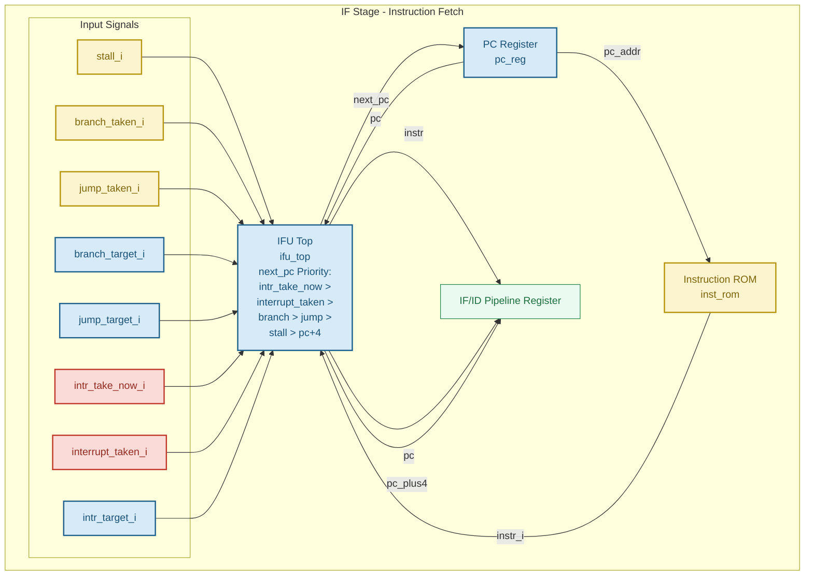

# IF Stage 结构框图

> 对应论文图 2：IF 阶段微架构
> 基于实际 RTL: `core/ifu/ifu_top.v` + `core/ifu/pc_reg.v`
> 最后更新：2026-06-13

## Mermaid 代码



## 关键信号说明

| 信号 | 类型 | 说明 |
|------|------|------|
| `intr_take_now_i` | 组合逻辑 | 中断 pending 的第一个周期即为 1，PC 立即跳转到 handler 地址 |
| `interrupt_taken_i` | 寄存器 | 中断接受后下一周期为 1，用于挡住 EX 阶段的旧分支/跳转信号 |
| `branch_taken_i` | EX 阶段 | 分支条件满足 |
| `jump_taken_i` | EX 阶段 | 无条件跳转（JAL/JALR） |
| `stall_i` | 组合逻辑 | Load-Use 停顿或中断期间的 IF 停顿 |

## next_pc 优先级链

```
intr_take_now  (最高) → PC = intr_target
interrupt_taken         → PC = pc + 4（顺序递增，挡住分支/跳转）
branch_taken            → PC = branch_target
jump_taken              → PC = jump_target
stall                   → PC = pc（保持）
pc + 4      (最低)      → 顺序执行
```

## 与旧版图的区别

旧版图只有 `interrupt_pending_i` + `intr_target_i`，缺少：
- `intr_take_now_i` — 组合逻辑立即跳转，是实现 2 周期恒定延迟的关键
- `interrupt_taken_i` — 寄存器信号，T2-T3 期间挡分支/跳转

这两个信号来自 `interrupt_pipeline.v`，是论文 III.E 节 "三处关键设计" 中的第一处。
