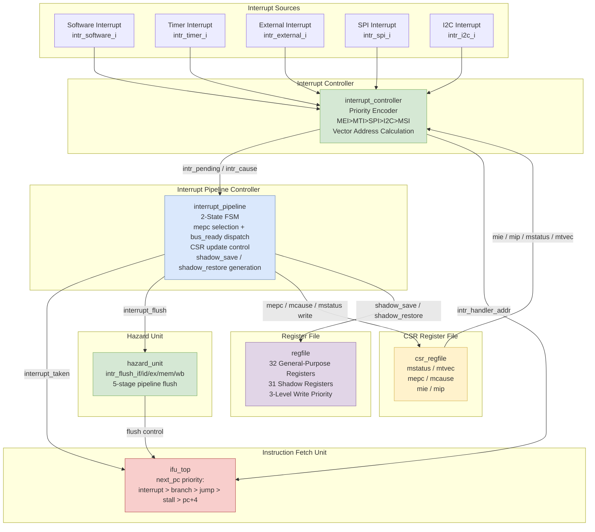
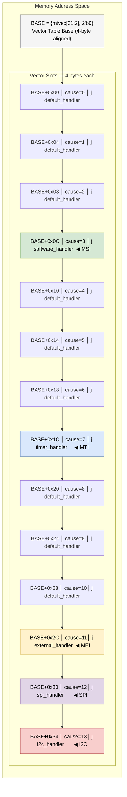
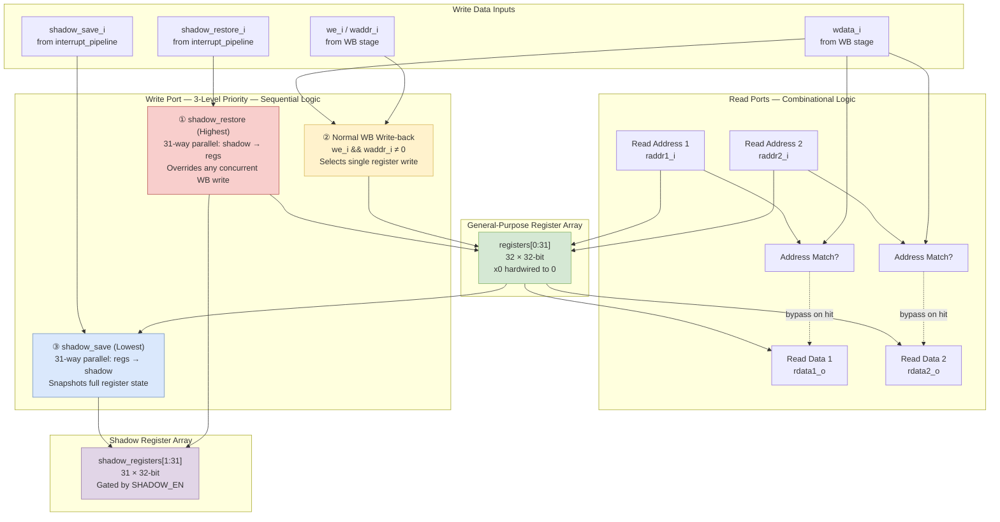

# Figures for "Interrupt Scheme and Shadow Registers" — English Version

## Figure X-1: Interrupt System Overall Architecture

**Render with**: https://mermaid.live



---

## Figure X-2: Vectored Mode Interrupt Vector Table Memory Layout

**Render with**: https://mermaid.live



---

## Figure X-3: Constant 2-Cycle Interrupt Response Timing Diagram

**Render with**: https://wavedrom.com/editor.html

Paste the entire `{ signal: [...] }` object below into the left editor panel.

```wavedrom
{ signal: [
  { name: 'clk',            wave: 'p..........', period: 2 },
  { name: 'GPIO intr',      wave: '01.0.......' },
  { name: 'intr_pending',   wave: '01...0.....' },
  { name: 'intr_accepted',  wave: '0.1.0......' },
  { name: 'intr_taken',     wave: '0.1.0......' },
  { name: 'CSR write',      wave: '0.1.0......', data: 'mepc mcause mstatus' },
  { name: 'intr_flush',     wave: '0.1.0......' },
  { name: 'PC (IF stage)',  wave: '=.=.=......', data: 'PC0  PC0+4  handler' },
  { name: 'shadow_save',    wave: '0...1.0....' },
  { name: 'x1-x31 regs',    wave: '=....=.....', data: 'original context  snapshot to shadow' },
],
  head: { text: 'Constant 2-Cycle Interrupt Response Timing' },
  foot: { text: ['GPIO fires', 'T0: accept intr', 'T1: PC=handler', 'ISR in IF'],
          tick: [1, 3, 5, 7] },
  config: { hscale: 2 }
}
```

**Timing explanation** (verified against RTL — `core_top.v`, `interrupt_pipeline.v`, `ifu_top.v`, `pc_reg.v`):

| Signal | Wave | Explanation |
|--------|------|-------------|
| `clk` | `p..........` (period=2) | 5 clock cycles. One full cycle = 2 time units (chars). Rising edges at tu 0, 2, 4, 6, 8. |
| `GPIO intr` | `01.0.......` | 1-cycle pulse: low at tu0, high at tu1-2, clears at tu3. |
| `intr_pending` | `01...0.....` | Follows GPIO but holds **1 extra cycle**: high at tu1-4 (2 cycles total). This ensures it is sampled by `interrupt_pipeline` at the rising edge. |
| `intr_accepted` | `0.1.0......` | 1-cycle registered pulse: high at tu2-3. Goes high at T0↑ (tu2), cleared at T1↑ (tu4). |
| `intr_taken` | `0.1.0......` | Same as `intr_accepted`. 1-cycle pulse. Fed to `ifu_top` as `interrupt_pending_i` for PC redirection. |
| `CSR write` | `0.1.0......` | `mepc`, `mcause`, `mstatus` written simultaneously at T0↑. |
| `intr_flush` | `0.1.0......` | 1-cycle pulse. `hazard_unit` fans this out to all 5 pipeline stages. |
| `PC (IF)` | `=.=.=......` | **PC0** (tu0-1) → **PC0+4** (tu2-3, updated at T0↑ when `pc_reg` sees old `intr_taken=0` and takes normal next PC) → **handler** (tu4+, updated at T1↑ when `pc_reg` sees `intr_taken=1` and `next_pc=intr_handler_addr`). |
| `shadow_save` | `0...1.0....` | 1-cycle pulse at tu4-5, delayed by 1 cycle after acceptance (triggers in `else if (interrupt_accepted)` branch at T1↑). |
| `x1-x31 regs` | `=....=.....` | Original context held until shadow_save, then snapshot taken. ISR can now freely modify registers. |

**Key timing relationship**:
- T0↑ (tu2): `intr_accepted<=1`, `intr_taken<=1`, `CSR write<=1`, `intr_flush<=1`, `PC<=PC0 (hold)`
- T1↑ (tu4): `intr_accepted<=0`, `shadow_save<=1`, `PC<=handler`
- ISR first instruction in IF at tu4 (cycle starting at T1↑)
- **Total: 2 cycles from acceptance to ISR in IF**

**Note**: After exporting SVG, add T0↑/T1↑ edge markers and the "2-cycle" brace annotation in a vector graphics editor.

---

## Figure X-4: Register File Internal Structure (with Shadow Registers)

**Render with**: https://mermaid.live



---

## Figure X-5: Complete Interrupt Lifecycle Timing Diagram (with Shadow Register Operations)

**Render with**: https://wavedrom.com/editor.html

Paste the entire `{ signal: [...] }` object below into the left editor panel.

```wavedrom
{ signal: [
  { name: 'clk',            wave: 'p.................', period: 2 },
  { name: 'GPIO intr',      wave: '01.0...............' },
  { name: 'intr_pending',   wave: '01...0.............' },
  { name: 'intr_accepted',  wave: '0.1.0..............' },
  { name: 'intr_taken',     wave: '0.1.0..............' },
  { name: 'CSR write',      wave: '0.1.0..............' },
  { name: 'intr_flush',     wave: '0.1.0..............' },
  { name: 'PC (IF stage)',  wave: '=.=.=......=.....=.', data: 'PC0  PC0+4  handler  mepc  mepc+4' },
  { name: 'shadow_save',    wave: '0...1.0............' },
  { name: 'x1-x31 regs',    wave: '=....=....=......=.', data: 'orig ctx  snapshot  modified by ISR  restored' },
  { name: 'id_ex_mret',     wave: '0.............1.0..' },
  { name: 'shadow_restore', wave: '0.............1.0..' },
  { name: 'mstatus MIE',    wave: '1..0.............1.', data: '1  0  1' },
],
  head: { text: 'Complete Interrupt Lifecycle with Shadow Register Save and Restore' },
  foot: { text: ['GPIO fires', 'T0 accept', 'T1 PC=handler', '', 'ISR running', '', 'MRET EX', 'resume'],
          tick: [1, 3, 5, 9, 16, 20, 22, 24] },
  config: { hscale: 2 }
}
```

**Timing explanation**:
- **tu 0-4**: Interrupt entry (same as Figure X-3). GPIO fires → `intr_pending` holds 2 cycles → T0↑ accept → T1↑ PC=handler + shadow_save.
- **tu 4-20**: ISR executes. `x1-x31` registers freely modified by ISR code. Shadow registers hold pre-interrupt snapshot. `mstatus.MIE` = 0 (interrupts disabled during ISR).
- **tu 22 (MRET in EX)**: `id_ex_mret` = 1 for one full cycle. `shadow_restore` fires (1-cycle pulse). x1-x31 restored from shadow registers in parallel. `mstatus.MIE` restored to 1 (interrupts re-enabled). `interrupt_processed` cleared.
- **tu 24+ (resume)**: PC = mepc. Interrupted program resumes execution transparently. x1-x31 identical to pre-interrupt state.

**Note**: Add phase bracket annotations (Phase 1-6) in a vector graphics editor after exporting SVG, as Wavedrom does not support multi-row overlay labels.

---

## Summary

| Figure | Content | Tool | How to Render |
|--------|---------|------|---------------|
| X-1 | Interrupt System Architecture | Mermaid | https://mermaid.live → paste code → export PNG/SVG |
| X-2 | Vector Table Memory Layout | Mermaid | https://mermaid.live → paste code → export PNG/SVG |
| X-3 | 2-Cycle Interrupt Timing | Wavedrom | https://wavedrom.com/editor.html → paste JSON → export SVG |
| X-4 | Register File with Shadow Regs | Mermaid | https://mermaid.live → paste code → export PNG/SVG |
| X-5 | Complete Interrupt Lifecycle Timing | Wavedrom | https://wavedrom.com/editor.html → paste JSON → export SVG |
