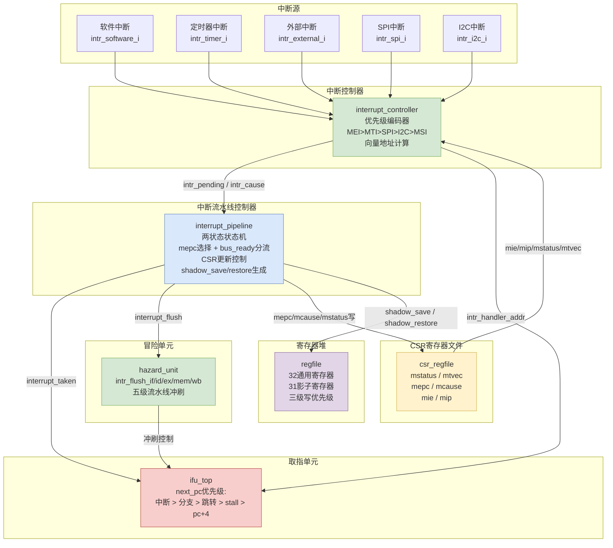
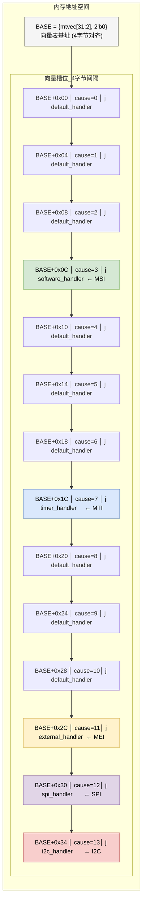
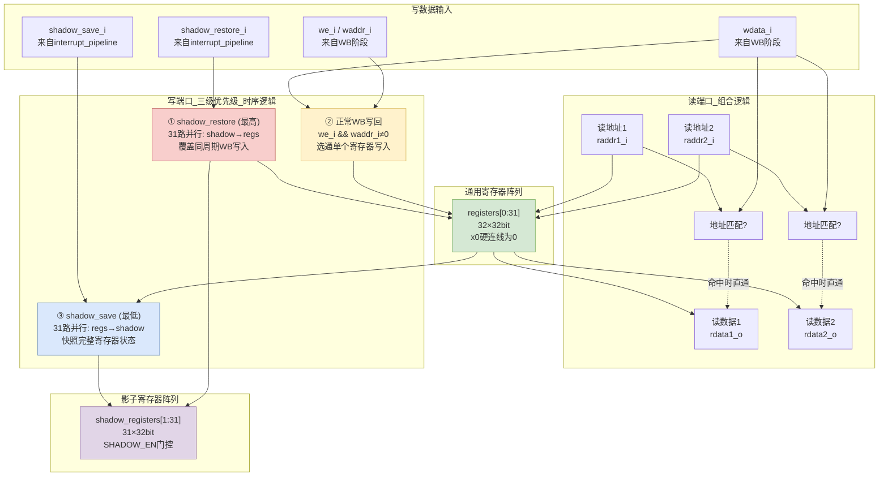

## 中断方案与影子寄存器

FX-RV32 的中断方案如图 X 所示。为兼顾低延迟和硬件复杂度的平衡，处理器实现了 RISC-V 特权架构规范的机器模式中断处理机制，支持五路中断源（软件中断、定时器中断、外部中断、SPI 中断和 I2C 中断），并创新性地引入了硬件影子寄存器实现单周期上下文保存与恢复，将中断响应延迟压缩至恒定的 2 个时钟周期。

每个中断源由中断控制器中的优先级编码器统一管理。优先级编码器在每个时钟周期组合逻辑地评估来自 mie（中断使能）和 mip（中断挂起）寄存器的中断状态，以及全局中断使能位 mstatus.MIE。当多个中断同时挂起时，按照 MEI（ID=11）> MTI（ID=7）> SPI（ID=12）> I2C（ID=13）> MSI（ID=3）的固定优先级选择最高优先级的中断，输出中断待处理标志和对应的异常原因码。中断向量模式由 mtvec 寄存器的低两位 MODE 字段选择。MODE=00 时为直接模式，所有中断统一跳转至 mtvec 指定的单一入口地址；MODE=01 时为向量模式，硬件根据中断原因码自动计算入口地址 handler_addr = BASE + (cause[4:0] << 2)，每个向量槽位为 4 字节，恰好容纳一条无条件跳转指令。向量表的内存布局如图 X 所示。

[插入图片X-1：中断系统整体架构框图]
[绘图代码见下方，使用 Mermaid 渲染，复制到 https://mermaid.live 即可导出 PNG/SVG]



[插入图片X-2：向量模式中断向量表内存布局]
[绘图代码见下方，使用 Mermaid 渲染]



中断的响应由中断流水线控制器（interrupt_pipeline）协调。该模块是一个两状态的状态机，维护 interrupt_accepted 和 interrupt_processed 两个内部标志位。其核心设计目标是实现恒定 2 周期中断延迟——无论当前流水线处于何种状态（EX 阶段是否有分支跳转、MEM 阶段是否有未完成的总线读），中断总能在 2 个时钟周期后进入 ISR 的第一条指令。这一特性的实现依赖于三处关键设计：

第一，取消传统设计中对 EX 和 MEM 阶段的阻塞条件。中断不再等待 EX 阶段的分支/跳转完成，也不再等待 MEM 阶段的 load 指令完成。取而代之的是，取指单元 next_pc 的优先级链（中断 > 分支 > 跳转 > stall > pc+4）天然保证了中断到来时 PC 直接跳转到中断向量地址，分支和跳转目标被自动忽略。

第二，引入总线就绪信号 bus_ready 对 MEM 阶段的 load 指令进行分流处理。当 MEM 阶段存在 load 且 bus_ready = 0（未完成）时，硬件掐断总线请求信号（bus_re_o），令外设取消事务，mepc 指向该 load 指令自身，MRET 返回后重新执行；当 MEM 阶段 load 已完成（bus_ready = 1）时，数据正常流入 WB 阶段写入寄存器堆，mepc 指向 load 的下一条指令（mem_pc + 4），避免已完成指令的重复执行。mepc 的完整选择规则如表 X 所示。

**表 X：mepc 选择规则**

| 最深有效阶段 | 条件 | mepc | MRET 后行为 |
|---|---|---|---|
| MEM | load 且 bus_ready = 0 | mem_pc | 重做 load |
| MEM | load 且 bus_ready = 1 | mem_pc + 4 | 跳过已完成 load |
| MEM | 非 load（store 等） | mem_pc + 4 | 继续执行 |
| EX | 任意（含分支/跳转） | ex_pc | 重做该指令 |
| ID | 任意 | id_pc | 重做该指令 |
| IF | 任意 | if_pc | 重做该指令 |

第三，中断发生时 hazard_unit 产生全局冲刷信号（intr_flush_if/id/ex/mem/wb），将五级流水线全部插入 NOP，保障被中断的部分执行结果不泄漏到 ISR 的执行上下文中。

表 X 对比了采用上述设计前后，各种流水线状态下的中断总延迟。

**表 X：中断总延迟对比**

| 流水线状态 | 改前 | 改后 |
|---|---|---|
| EX 无分支，MEM 无 load | 2 周期 | 2 周期 |
| EX 有分支/跳转 | 3 周期 | 2 周期 |
| MEM 有 load（已完成） | 3 周期 | 2 周期 |
| MEM 有 load（未完成） | 2+N 周期 | 2 周期 |
| EX 分支 + MEM load | 4+N 周期 | 2 周期 |

[插入图片X-3：恒定两周期中断响应时序图]
[绘图代码见下方，使用 Wavedrom 渲染，复制 JSON 到 https://wavedrom.com/editor.html 即可导出 PNG/SVG]

```wavedrom
{ signal: [
  { name: 'clk',          wave: 'p..........', period: 2 },
  { name: 'GPIO中断',     wave: '01.0.......' },
  { name: 'intr_pending', wave: '01...0.....' },
  { name: 'intr_accepted',wave: '0.1.0......' },
  { name: 'intr_taken',   wave: '0.1.0......' },
  { name: 'CSR写使能',    wave: '0.1.0......', data: 'mepc mcause mstatus' },
  { name: 'intr_flush',   wave: '0.1.0......' },
  { name: 'PC(IF阶段)',   wave: '=.=.=......', data: 'PC0  PC0+4  handler' },
  { name: 'shadow_save',  wave: '0...1.0....' },
  { name: 'x1-x31寄存器', wave: '=....=.....', data: '原始上下文  快照至影子寄存器' },
],
  head: { text: '恒定2周期中断响应时序' },
  foot: { text: ['GPIO触发', 'T0: 接受中断', 'T1: PC=handler', 'ISR进入IF'],
          tick: [1, 3, 5, 7] },
  config: { hscale: 2 }
}
```

> **时序说明**（逐信号对照 RTL）：
>
> | 信号 | 波形 | 说明 |
> |------|------|------|
> | `clk` | `p..........` (period=2) | 5 个时钟周期。每周期 = 2 tu。上升沿在 tu 0, 2, 4, 6, 8。 |
> | `GPIO中断` | `01.0.......` | 持续 1 个周期的高脉冲（tu1-2）。 |
> | `intr_pending` | `01...0.....` | 比 GPIO 多持续 **1 个周期**（tu1-4，共 2 周期）。确保在上升沿被 `interrupt_pipeline` 采样到。 |
> | `intr_accepted` | `0.1.0......` | 持续 **1 个完整周期**的寄存器脉冲（tu2-3）。在 T0↑（tu2）置 1，T1↑（tu4）清零。 |
> | `intr_taken` | `0.1.0......` | 同上，1 周期脉冲。送至 `ifu_top` 的 `interrupt_pending_i` 用于 PC 重定向。 |
> | `CSR写使能` | `0.1.0......` | `mepc`、`mcause`、`mstatus` 在 T0↑ 同时写入。 |
> | `intr_flush` | `0.1.0......` | 1 周期脉冲，`hazard_unit` 将其扇出至全部五级流水线。 |
> | `PC(IF阶段)` | `=.=.=......` | **PC0**（tu0-1）→ **PC0+4**（tu2-3，T0↑ 时 `pc_reg` 看到旧 `intr_taken=0`，取正常下一 PC）→ **handler**（tu4+，T1↑ 时 `pc_reg` 看到 `intr_taken=1`，`next_pc=intr_handler_addr`）。 |
> | `shadow_save` | `0...1.0....` | 延迟 1 周期，在 T1↑（tu4）触发（对应代码 `else if (interrupt_accepted)` 分支）。 |
> | `x1-x31寄存器` | `=....=.....` | 原始上下文保持至 shadow_save，随后快照至影子寄存器。ISR 可自由修改。 |
>
> **关键时序关系**：
> - T0↑（tu2）：`intr_accepted<=1`、`intr_taken<=1`、CSR 写`<=1`、`intr_flush<=1`、`PC<=PC0+4`
> - T1↑（tu4）：`intr_accepted<=0`、`shadow_save<=1`、`PC<=handler`
> - ISR 首条指令在 tu4（T1↑之后）进入 IF 阶段
> - **从中断接受到 ISR 进入 IF：恒为 2 个时钟周期**
```

> **Wavedrom 使用说明**：访问 https://wavedrom.com/editor.html ，将上面 `{ signal: [...] }` 的 JSON 部分粘贴到左侧编辑器，右侧实时预览。点击 "Export as SVG" 导出矢量图插入论文。

为消除中断服务程序中软件保存/恢复寄存器上下文的开销，FX-RV32 在寄存器堆中内置了一组硬件影子寄存器，共 31 个 32 位寄存器，对应 x1-x31（x0 硬连线为 0 无需保存）。图 X 展示了含影子寄存器的寄存器堆内部结构。

[插入图片X-4：寄存器堆内部结构（含影子寄存器）]
[绘图代码见下方，使用 Mermaid 渲染]



影子寄存器的操作与中断流水线控制器的状态转移紧密同步。中断被接受的次周期（T1↑），在流水线冲刷和所有处于流水线中尚未完成写回（即已进入 ID、EX、MEM 阶段但尚未到达 WB 阶段）的指令的寄存器写回完成之后，shadow_save 信号产生单周期脉冲，将当前 x1-x31 的完整寄存器状态并行快照到影子寄存器中。MRET 指令进入 EX 阶段时，interrupt_pipeline 检测到 id_ex_mret 信号，在同一时钟上升沿将 shadow_restore 置为有效，该信号在下一个时钟上升沿触发寄存器堆将影子寄存器中的全部值并行写回 x1-x31，同时清零 interrupt_processed 标志并恢复 mstatus.MIE，处理器重新具备中断响应能力。寄存器堆的写优先级设计为 shadow_restore（最高）> 正常 WB 写回 > shadow_save（最低），确保恢复时 ISR 中的寄存器修改被完全覆盖、保存时流水线中尚在执行但已产生结果的指令（如 MEM 阶段刚完成的总线读）的写回数据先于快照被写入寄存器堆，从而保证影子寄存器中保存的是真正完整的寄存器状态。

图 X 以中断触发到返回的全流程时序展示了影子寄存器的保存和恢复时机。

[插入图片X-5：中断处理全流程时序图（含影子寄存器操作）]
[绘图代码见下方，使用 Wavedrom 渲染]

```wavedrom
{ signal: [
  { name: 'clk',          wave: 'p.................', period: 2 },
  { name: 'GPIO中断',     wave: '01.0...............' },
  { name: 'intr_pending', wave: '01...0.............' },
  { name: 'intr_accepted',wave: '0.1.0..............' },
  { name: 'intr_taken',   wave: '0.1.0..............' },
  { name: 'CSR写使能',    wave: '0.1.0..............' },
  { name: 'intr_flush',   wave: '0.1.0..............' },
  { name: 'PC(IF阶段)',   wave: '=.=.=......=.....=.', data: 'PC0  PC0+4  handler  mepc  mepc+4' },
  { name: 'shadow_save',  wave: '0...1.0............' },
  { name: 'x1-x31寄存器', wave: '=....=....=......=.', data: '原始上下文  快照  ISR修改  恢复' },
  { name: 'id_ex_mret',   wave: '0.............1.0..' },
  { name: 'shadow_restore',wave:'0.............1.0..' },
  { name: 'mstatus MIE',  wave: '1..0.............1.', data: '1  0  1' },
],
  head: { text: '中断处理全流程时序（含影子寄存器保存与恢复）' },
  foot: { text: ['GPIO触发', 'T0接受', 'T1 PC=handler', '', 'ISR执行中', '', 'MRET在EX', '恢复执行'],
          tick: [1, 3, 5, 9, 16, 20, 22, 24] },
  config: { hscale: 2 }
}
```

> **时序说明**：
> - **tu 0-4**：中断进入（同图X-3）。GPIO触发 → `intr_pending` 保持2周期 → T0↑接受 → T1↑ PC=handler + 影子保存。
> - **tu 4-20**：ISR 执行。`x1-x31` 被 ISR 代码自由修改。影子寄存器保持中断前快照。`mstatus.MIE` = 0（关中断）。
> - **tu 22（MRET 进入 EX）**：`id_ex_mret` = 1 持续一个完整周期。`shadow_restore` 触发单周期脉冲。x1-x31 从影子寄存器并行恢复。`mstatus.MIE` 恢复为 1（重开中断）。`interrupt_processed` 清零。
> - **tu 24+**：PC = mepc，被中断程序从断点透明恢复执行，x1-x31 与中断前完全一致。
```

影子寄存器机制对软件完全透明，中断服务程序无需任何手动 push/pop 操作。影子寄存器的核心价值在于：通用寄存器的硬件保存仅需 1 个时钟周期（中断进入时由 shadow_save 单周期脉冲触发并行快照），通用寄存器的硬件恢复同样仅需 1 个时钟周期（MRET 返回时由 shadow_restore 单周期脉冲触发并行写回）。相比之下，若采用传统的软件栈保存/恢复方案，每保存一个寄存器需一条 store 指令，每恢复一个寄存器需一条 load 指令，全部 31 个可写寄存器的保存和恢复共需 62 条访存指令、耗费近百个时钟周期。在完整的中断往返延迟方面，中断进入为 2 个时钟周期（从中断接受到 ISR 首条指令进入 IF），MRET 返回为 3 个时钟周期（MRET 在 EX 阶段执行 → PC 跳转至 mepc 并取指 → 影子寄存器恢复完成、被中断程序的首条指令进入 ID 阶段并使用恢复后的寄存器值）。

影子寄存器功能受编译期参数 SHADOW_EN 控制，该参数独立定义在 id_top 模块和 interrupt_pipeline 模块中。当 SHADOW_EN = 0 时，影子寄存器及其控制逻辑被综合工具完全优化，ISR 需通过软件栈操作手动保存/恢复上下文，适用于面积敏感或需支持中断嵌套的场景。当前设计仅提供单组影子寄存器，因此不支持中断嵌套。若需嵌套中断，可将影子寄存器扩展为多组堆栈结构。

CSR 寄存器文件实现了机器模式下的全部核心 CSR，包括 mstatus、mtvec、mepc、mcause、mie、mip、mscratch 和 mtval，以及 mcycle、minstret 两个 64 位硬件性能计数器。其关键设计特点是双端口写架构：一个端口服务于 CSR 指令（CSRRW/CSRRS/CSRRC 及其立即数变体），另一个端口服务于中断响应时中断流水线控制器对 mepc、mcause 和 mstatus 的并发更新，两个端口在同一周期内可同时有效且互不冲突。

在上述中断系统架构下，从中断源触发到 ISR 首条指令取指的总延迟恒定为 2 个时钟周期，在 200MHz 工作频率下仅为 10 ns。MRET 返回延迟为 3 个时钟周期（MRET 执行 → PC 跳转至 mepc → 影子恢复 → 被中断程序首条指令进入 ID）。硬件影子寄存器将通用寄存器的保存和恢复各压缩至 1 个时钟周期——在 200MHz 下各仅需 5 ns，而软件方案仅保存全部 31 个寄存器就需要至少 62 条访存指令（每条至少 1 个时钟周期），影子寄存器使其开销降低了两个数量级。
